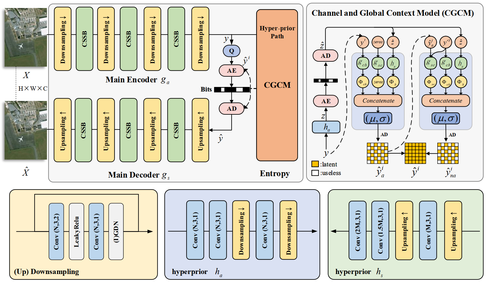
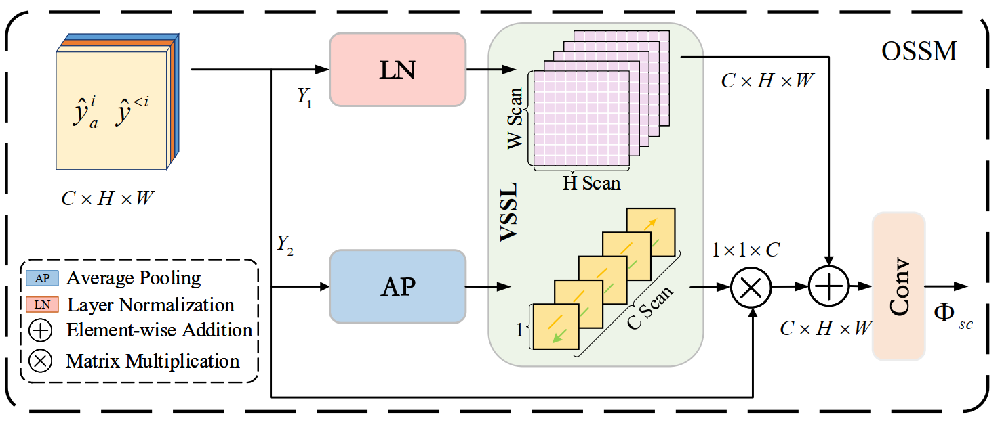
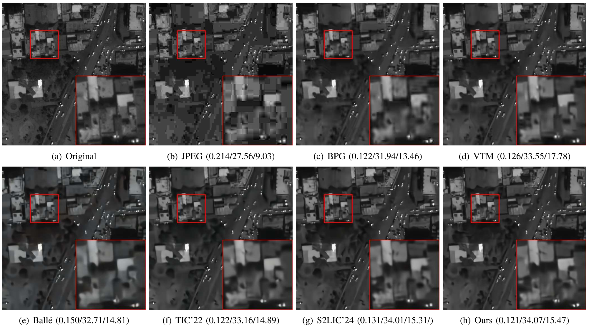

# Towards an Efficient Remote Sensing Image Compression Network with Visual State Space Model

## Architectures
The overall framework.

The proposed the Omni-Selective Scan Module.

## Reconstructed Samples

